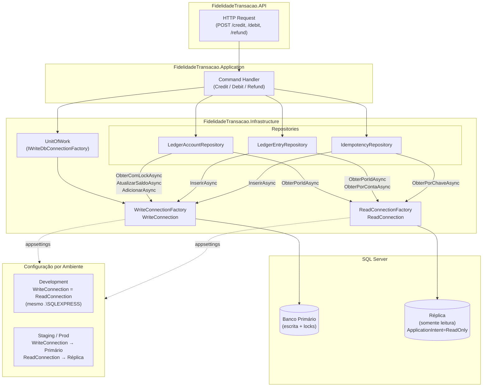
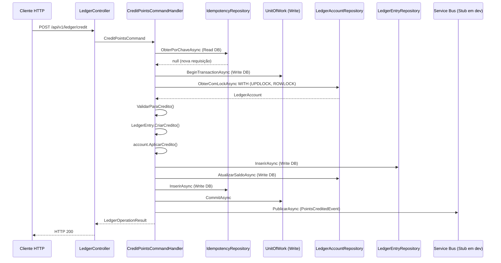

# Changelog — FidelidadeTransacao

Registro das mudanças realizadas na sessão de setup e evolução do projeto.

---

## [1] Setup do ambiente local

### Problema
O projeto não subia localmente por falta de pré-requisitos e configurações.

### O que foi feito
- Identificada a instância SQL Server como `.\SQLEXPRESS` (não `localhost`)
- Criado o banco `LedgerDb` via `001_CreateDatabase.sql`
- Identificado e corrigido erro no `002_CreateSchema.sql`: índice filtrado com `SYSDATETIMEOFFSET()` não é permitido pelo SQL Server em filtered indexes — removida a cláusula `WHERE` do índice `IX_IdempotencyRecords_ExpiresAt`
- Tabela `IdempotencyRecords` criada manualmente após falha parcial do script de schema
- Seed de dados inserido via `003_SeedData.sql`
- Connection string atualizada em `appsettings.Development.json` de `localhost` para `.\SQLEXPRESS`

### Arquivo alterado
- `database/002_CreateSchema.sql` — removida cláusula `WHERE ExpiresAt < SYSDATETIMEOFFSET()` do índice filtrado
- `src/FidelidadeTransacao.API/appsettings.Development.json` — server atualizado para `.\SQLEXPRESS`

---

## [2] Correção do GenerateDevToken

### Problema
Build do projeto `tools/GenerateDevToken` falhava com erro de sintaxe:

```
error CS8635: Sequência de caracteres inesperada '...'
```

### Causa
O código usava o operador spread (`...`) para concatenar arrays de claims — recurso disponível apenas no C# 13, mas o projeto usa C# 12.

### Solução
Substituído o spread operator por um `List<Claim>` com `Add()` condicional:

```csharp
// Antes (C# 13 — inválido no projeto)
var claims = new[]
{
    new Claim(...),
    ...(role == "LedgerAdmin" ? new[] { ... } : Array.Empty<Claim>())
};

// Depois (C# 12 — compatível)
var claims = new List<Claim> { new Claim(...) };
if (role == "LedgerAdmin")
{
    claims.Add(new Claim(ClaimTypes.Role, "LedgerPartner"));
    claims.Add(new Claim(ClaimTypes.Role, "LedgerAuditor"));
}
```

### Arquivo alterado
- `tools/GenerateDevToken/Program.cs`

---

## [3] Separação de conexões Read/Write — CQRS

### Problema
A aplicação usava uma única `IDbConnectionFactory` com `DefaultConnection` para todas as operações — leituras e escritas passavam pela mesma string de conexão, impedindo a separação de banco primário e réplica em staging/produção.

### Solução
Introduzidas duas interfaces e duas implementações de connection factory:

| Interface | Implementação | Connection String | Uso |
|---|---|---|---|
| `IWriteDbConnectionFactory` | `WriteConnectionFactory` | `WriteConnection` | Commands, UnitOfWork, locks (UPDLOCK) |
| `IReadDbConnectionFactory` | `ReadConnectionFactory` | `ReadConnection` | Queries sem transação, réplica |

**Regra de roteamento por repositório:**

| Operação | Banco | Motivo |
|---|---|---|
| `ObterComLockAsync` | Write (primário) | Requer `UPDLOCK + ROWLOCK` dentro de transação |
| `AtualizarSaldoAsync` | Write (primário) | UPDATE dentro de transação |
| `InserirAsync` (Entry, Idempotency) | Write (primário) | INSERT dentro de transação |
| `ObterPorIdAsync` | Read (réplica) | Leitura simples, sem lock |
| `ObterPorContaAsync` | Read (réplica) | Query paginada, sem lock |
| `ObterPorChaveAsync` (Idempotency) | Read (réplica) | Ocorre antes do BEGIN TRAN |

### Configuração por ambiente

**Development** (`appsettings.Development.json`) — mesmo banco para os dois:
```json
"ConnectionStrings": {
  "WriteConnection": "Server=.\\SQLEXPRESS;Database=LedgerDb;Trusted_Connection=True;TrustServerCertificate=True;MultipleActiveResultSets=True;",
  "ReadConnection":  "Server=.\\SQLEXPRESS;Database=LedgerDb;Trusted_Connection=True;TrustServerCertificate=True;MultipleActiveResultSets=True;"
}
```

**Staging / Produção** (`appsettings.json`) — bancos separados, injetados pelo pipeline:
```json
"ConnectionStrings": {
  "WriteConnection": "Server=SEU-SERVIDOR-PRIMARIO;Database=LedgerDb;User Id=$(DB_WRITE_USER);Password=$(DB_WRITE_PASS);TrustServerCertificate=True;",
  "ReadConnection":  "Server=SEU-SERVIDOR-REPLICA;Database=LedgerDb;User Id=$(DB_READ_USER);Password=$(DB_READ_PASS);TrustServerCertificate=True;ApplicationIntent=ReadOnly;"
}
```

Para Azure DevOps / GitHub Actions, sobrescrever via variáveis de ambiente:
```
ConnectionStrings__WriteConnection=...
ConnectionStrings__ReadConnection=...
```

### Arquivos alterados
- `src/FidelidadeTransacao.Infrastructure/Persistence/DbConnectionFactory.cs` — removida `IDbConnectionFactory`/`SqlServerConnectionFactory`, adicionadas `IWriteDbConnectionFactory`/`WriteConnectionFactory` e `IReadDbConnectionFactory`/`ReadConnectionFactory`
- `src/FidelidadeTransacao.Infrastructure/Persistence/UnitOfWork.cs` — construtor atualizado para receber `IWriteDbConnectionFactory`
- `src/FidelidadeTransacao.Infrastructure/Persistence/Repositories/LedgerAccountRepository.cs` — `ObterPorIdAsync` migrado para `readFactory`
- `src/FidelidadeTransacao.Infrastructure/Persistence/Repositories/LedgerEntryRepository.cs` — `ObterPorIdAsync` e `ObterPorContaAsync` migrados para `readFactory`
- `src/FidelidadeTransacao.Infrastructure/Persistence/Repositories/IdempotencyRepository.cs` — `ObterPorChaveAsync` migrado para `readFactory`
- `src/FidelidadeTransacao.Infrastructure/DependencyInjection.cs` — registro das duas factories como Singleton
- `src/FidelidadeTransacao.API/appsettings.json` — keys renomeadas para `WriteConnection` / `ReadConnection`
- `src/FidelidadeTransacao.API/appsettings.Development.json` — keys renomeadas, ambas apontando para `.\SQLEXPRESS`

---

## Diagrama — Arquitetura CQRS de Conexões



---

## Diagrama — Fluxo de uma operação de Crédito



---

## IDs de seed para testes

| AccountId | Saldo | Uso |
|---|---|---|
| `aaaaaaaa-aaaa-aaaa-aaaa-aaaaaaaaaaaa` | 4.500 pts | Testes gerais de débito/crédito |
| `bbbbbbbb-bbbb-bbbb-bbbb-bbbbbbbbbbbb` | 1.000 pts | Testes gerais |
| `cccccccc-cccc-cccc-cccc-cccccccccccc` | 0 pts | Testar RN01 (saldo insuficiente) |

| EntryId | Tipo | Uso |
|---|---|---|
| `e3333333-3333-3333-3333-333333333333` | Debit 500 pts | `OriginalTransactionId` para testar Refund |
