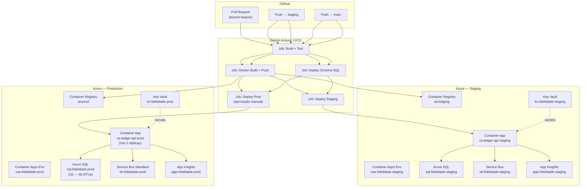

# Deploy no Azure — Ledger API

Guia completo de provisionamento e configuração do pipeline para staging e produção.

---

## Arquitetura provisionada



---

## Pré-requisitos

- Azure CLI: `az login`
- Bicep CLI: `az bicep install`
- GitHub repository com os secrets configurados (seção abaixo)
- Permissão de Contributor no Azure Subscription

---

## Passo 1 — Provisionar a infraestrutura

Execute uma vez por ambiente:

```powershell
# Staging
.\scripts\azure-bootstrap.ps1 -Environment staging -SqlAdminPassword "SuaSenhaForte!"

# Produção
.\scripts\azure-bootstrap.ps1 -Environment prod -SqlAdminPassword "SuaSenhaForte!"
```

O script cria todos os recursos via Bicep e exibe os outputs necessários para configurar os secrets do GitHub.

---

## Passo 2 — Configurar GitHub Secrets

Acesse: `GitHub → Settings → Secrets and variables → Actions`

### Secrets de Infraestrutura (compartilhados)

| Secret | Valor | Onde obter |
|---|---|---|
| `AZURE_CREDENTIALS_STAGING` | JSON do Service Principal | `az ad sp create-for-rbac` |
| `AZURE_CREDENTIALS_PROD`    | JSON do Service Principal | `az ad sp create-for-rbac` |

Gerar o Service Principal:
```bash
az ad sp create-for-rbac \
  --name "sp-ledger-github-staging" \
  --role Contributor \
  --scopes /subscriptions/SUBSCRIPTION_ID/resourceGroups/rg-fidelidade-staging \
  --sdk-auth
```
Cole o JSON completo no secret `AZURE_CREDENTIALS_STAGING`.

### Secrets — Staging

| Secret | Descrição |
|---|---|
| `ACR_LOGIN_SERVER_STAGING` | Ex: `acrfidelidadestaging.azurecr.io` |
| `ACR_NAME_STAGING`         | Ex: `acrfidelidadestaging` |
| `ACR_USERNAME`             | Admin username do ACR |
| `ACR_PASSWORD`             | Admin password do ACR |
| `SQL_SERVER_STAGING`       | FQDN do SQL Server |
| `SQL_USER_STAGING`         | Usuário SQL |
| `SQL_PASSWORD_STAGING`     | Senha SQL |
| `SQL_WRITE_CONN_STAGING`   | Connection string completa (Write) |
| `SQL_READ_CONN_STAGING`    | Connection string completa (Read) |
| `SERVICEBUS_CONN_STAGING`  | Connection string do Service Bus |
| `JWT_SECRET_STAGING`       | JWT Secret Key (mín. 32 chars) |
| `APPINSIGHTS_CONN_STAGING` | Connection string do App Insights |

### Secrets — Production

Mesmos nomes com sufixo `_PROD`:
`ACR_LOGIN_SERVER_PROD`, `SQL_WRITE_CONN_PROD`, `JWT_SECRET_PROD`, etc.

### Formato das connection strings

**Write (banco primário):**
```
Server=sql-fidelidade-prod.database.windows.net;Database=LedgerDb;User Id=ledgeradmin;Password=SuaSenha;TrustServerCertificate=True;
```

**Read (réplica — ApplicationIntent=ReadOnly):**
```
Server=sql-fidelidade-prod.database.windows.net;Database=LedgerDb;User Id=ledgeradmin;Password=SuaSenha;TrustServerCertificate=True;ApplicationIntent=ReadOnly;
```

**Service Bus:**
```
Endpoint=sb://sb-fidelidade-prod.servicebus.windows.net/;SharedAccessKeyName=RootManageSharedAccessKey;SharedAccessKey=SUA_CHAVE
```

---

## Passo 3 — Criar banco e schema manualmente (primeira vez)

O pipeline executa os scripts de schema automaticamente em cada deploy, mas o banco precisa existir antes. O Bicep cria o banco vazio, mas os scripts DDL precisam rodar:

```bash
# Staging
sqlcmd -S sql-fidelidade-staging.database.windows.net \
       -U ledgeradmin -P SuaSenha \
       -i database/002_CreateSchema.sql -b

# Produção — NÃO rode o seed em produção
sqlcmd -S sql-fidelidade-prod.database.windows.net \
       -U ledgeradmin -P SuaSenha \
       -i database/002_CreateSchema.sql -b
```

---

## Passo 4 — Configurar aprovação manual para produção

No GitHub:
1. `Settings → Environments → New environment → production`
2. Em **Required reviewers**, adicione os aprovadores
3. O job `deploy-prod` aguardará aprovação antes de executar

---

## Fluxo de branches

| Branch | Ambiente | Aprovação |
|---|---|---|
| `feature/*` | Apenas CI (build + test) | Não |
| `staging` | Deploy em Staging | Não |
| `main` | Deploy em Produção | **Sim — manual** |

---

## Variáveis de ambiente no Container App

As variáveis sensíveis são injetadas via `secretref:` no Container App — nunca expostas como env vars plain text:

```
ConnectionStrings__WriteConnection  → secretref:write-conn
ConnectionStrings__ReadConnection   → secretref:read-conn
ConnectionStrings__ServiceBus       → secretref:servicebus-conn
JwtSettings__SecretKey              → secretref:jwt-secret
```

Variáveis não-sensíveis são definidas diretamente:
```
ASPNETCORE_ENVIRONMENT     = Production
JwtSettings__Issuer        = ledger-api
JwtSettings__Audience      = ledger-clients
ApplicationInsights__ConnectionString = <valor do App Insights>
```

---

## Health checks

Os endpoints `/health` e `/health/ready` são configurados como probes no Container App:

- **Liveness** (`/health`) — se falhar 3x: container é reiniciado
- **Readiness** (`/health/ready`) — se falhar: container sai do load balancer

O pipeline verifica o health check por até 2,5 minutos após o deploy antes de marcar como sucesso.

---

## Escalonamento automático

| Ambiente | Min réplicas | Max réplicas | Trigger |
|---|---|---|---|
| Staging | 1 | 3 | 50 req simultâneas |
| Produção | 2 | 10 | 50 req simultâneas |

Em produção, mínimo de 2 réplicas garante alta disponibilidade mesmo durante deploys (rolling update).
